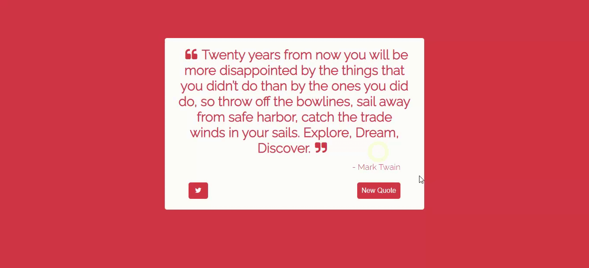

# Random Quote Generator 

## Description
This is a project from freecodecamp.org to practice creating apps using ReactJS. The app fetches a JSON file containing quotes and displays a random quote to the user. The user can click on the "New Quote" button to display a new, random quote within the JSON file. 

### Demo 

